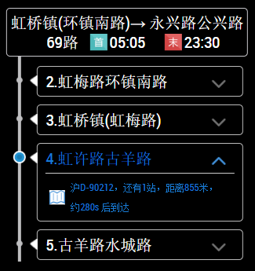

## MMM-ShanghaiBus

**Get Info for Shanghai Bus**

## Same church, different pew

I wanted to take a new approach at a weather module. Until now, I had only done WWI and WWI2 but I
wasn't really happy with those, although they were fun to do. This has a bit more style to it (not much)
and it doesn't resemble other modules in format or appearance. I learned a couple of new things while
doing it and I used what I learned in the module itself. Nothing monumental but very satisfying for me.

## Good-bye bottom_bar or lower_thid

* This was designed for use in the bottom_bar or lower_third position of your MagicMirror
* My first real use of icons in a module, denoting the upcoming forecast
* Weather forecast for day and night
* Only the current weather is written out in words

## Examples

* top_center

## Installation and requirements

* `git clone https://github.com/wxq8503/MMM-ShanghaiBus` into the `~/MagicMirror/modules` directory.

request

## Config.js entry and options

    {
		module: 'MMM-ShanghaiBus',
		position: 'top_center',
		config: {
			routerName: "69路",
			direction: "1",
			checkStation: 4,
			showStations: 4,
			updateInterval: 300 * 1000           // 30 seconds
		}
	},

## Country codes here (If you're not in the US)

